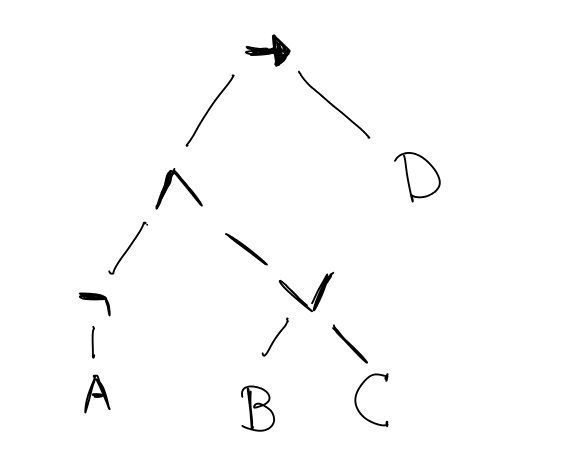

# Problem Sheet on Propositional Logic


## Exercise 1

Draw a parse tree for the formula ((¬A) ∧ (B ∨ C)) → D.

<details><summary>Solution</summary>



</details>	
	
## Exercise 2

Write two sentences in English : one which uses "or" in an exclusive way, and one which uses "or" in an inclusive way.

<details><summary>Solution</summary>

- Inclusive: "Would you like cream or sugar in your coffee?"
- Exclusive: "Are you for or against Fred's suggestion?"

</details>	
	
## Exercise 3

Note: This is an exercise about the importance of parentheses.

Let P be the proposition 2+2=5. Let Q be the proposition 1+1=3. Let R be the proposition 5+5=10. For the aforementioned definitions of P, Q, and R, check that (P∧ Q)∨ R is true and P∧ (Q∨ R) is false, and hence they are indeed two different formulas!

<details><summary>Solution</summary>

P is false, Q is false and R is true. We use the symbol ⊥ for false and ⊤ for true. Then (P∧ Q)∨ R is same as (⊥ ∧ ⊥) ∨ ⊤, which is equivalent to ⊤, and P∧ (Q∨ R) is same as ⊥ ∧ (⊥ ∨ ⊤) is equivalent to ⊥. Note that there is a bit of subtlety here about "giving meaning to propositions".

</details>

## Exercise 4

Give a (natural deduction) proof of (Q → R) → R from the hypothesis Q.

<details><summary>Solution</summary>

```
---[Hyp]    ------[Ass(1)]      
 Q	    Q → R      
--------------------- [→ E]     
      R    
-------------- [→ I, 1]     
(Q → R) → R       
```

</details>

## Exercise 5

Give a (natural deduction) proof of P → (Q ∧ R) from the hypotheses P → Q , Q → R.

<details><summary>Solution</summary>

```
--[Ass(1)]  -----[Hyp]    --(1) -----[Hyp]      
P           P→ Q          Q     Q → R       
---------------[→ E]   -------------[→ E]   
   Q      	           R    
---------------------------------[∧ I]    
     Q ∧ R   
---------------	[→ I, 1]   
  P → (Q ∧ R)   
```
	
</details>

## Exercise 6

Give a (natural deduction) proof of ¬(A ∧ B) from the hypothesis (A → C) ∧ (B → ¬C).

<details><summary>Solution</summary>
 
```
-----[Ass(1)]           -----[Ass(1)]     
A ∧ B                A ∧ B     
-----  -----[Hyp]    -----[∧ E]  -------[Hyp]    
A      A → C           B          B → ¬C      
------------[→ E]    -------------------[→ E]       
   C 		            ¬ C     
--------------------------------	[¬ E]     
		⊥      
--------------------------------	[→ I, 1]         
	     ¬ (A ∧ B)      
```

</details>
	
## Exercise 7

In the Lean code below, replace all uses of "sorry" by proofs.
Hint: Start by replacing `sorry` by `_` (an underscore) to make Lean show you the proof goal.

```lean
variables A B C : Prop

section and_or
variable a : A
variable b : B
variable c : C
include a
include b
include c

example : C ∨ B := sorry
example : B ∨ C := sorry

example : (A ∧ B) ∧ (C ∨ B) :=
  and.intro
     sorry
     sorry

example : (B ∨ C) ∨ A := sorry
end and_or

section or_elimination
variable h : C ∨ B
variable ba : B → A
variable ca : C → A
example : A := sorry
end or_elimination

section from_false_get_anything
variable f : false
include f
example : A := sorry
end from_false_get_anything

example : true := sorry
```

<details><summary>Solution</summary>

```lean
section exercise

variables A B C : Prop

section and_or
variable a : A
variable b : B
variable c : C
include a
include b
include c

example : C ∨ B := or.intro_left B c
--other possibility: or.intro_right C b

example : B ∨ C := or.intro_right B c
--other possibility: or.intro_left C b

example : (A ∧ B) ∧ (C ∨ B) :=
  and.intro
     (and.intro a b)
     (or.intro_right C b) --other possibility: or.intro_left B c

example : (B ∨ C) ∨ A := 
          or.intro_right _ a
-- more explicitly: or.intro_right (B ∨ C) a
--Note that Lean infers "B ∨ C", we can leave an underscore here
--
--other possibilities: 
-- or.intro_left _ (or.intro_left C b)
-- or.intro_left _ (or.intro_right B c)
end and_or

section or_elimination
variable h : C ∨ B
variable ba : B → A
variable ca : C → A
example : A := or.elim h ca ba
end or_elimination

section from_false_get_anything
variable f : false
include f
example : A := false.elim f
end from_false_get_anything

example : true := trivial

end exercise
```

</details>

## Exercise 8

Formulate and prove the following statements in Lean:
- (a) A → B → C → (A ∧ B) ∧ (A ∧ C)
- (b) C → A → B → (A ∧ B) ∧ (A ∧ C)
- (c) A → A ∨ A
- (d) A ∧ B → B ∧ A

<details><summary>Solution</summary>

```lean
section exercise

--assume propositions A, B, C
variables A B C : Prop

-- A → B → C → (A ∧ B) ∧ (A ∧ C)
-- To understand how to construct the proof,
-- consider the following sequence of intermediate steps.
-- The underscores `_` tell you what is required next.
-- See also the handout on proof strategies.

example : A → B → C → (A ∧ B) ∧ (A ∧ C) := _

example : A → B → C → (A ∧ B) ∧ (A ∧ C) := 
  assume a : A, _

example : A → B → C → (A ∧ B) ∧ (A ∧ C) := 
  assume a : A, 
  assume b : B, _

example : A → B → C → (A ∧ B) ∧ (A ∧ C) := 
  assume a : A, 
  assume b : B,   
  assume c : C, _
  
example : A → B → C → (A ∧ B) ∧ (A ∧ C) := 
  assume a : A, 
  assume b : B,   
  assume c : C,
  and.intro 
    _ 
    _ 

example : A → B → C → (A ∧ B) ∧ (A ∧ C) := 
  assume a : A, 
  assume b : B,   
  assume c : C,
  and.intro 
    (and.intro _ _) 
    _ 

example : A → B → C → (A ∧ B) ∧ (A ∧ C) := 
  assume a : A, 
  assume b : B,   
  assume c : C,
  and.intro 
    (and.intro a b) 
    (and.intro _ _)

example : A → B → C → (A ∧ B) ∧ (A ∧ C) := 
  assume a : A, 
  assume b : B,   
  assume c : C,
  and.intro 
    (and.intro a b) 
    (and.intro a c)


-- C → A → B → (A ∧ B) ∧ (A ∧ C)
example : C → A → B → (A ∧ B) ∧ (A ∧ C) :=
  assume c : C,
    assume a : A,
      assume b : B,
        and.intro
          (and.intro a b)
          (and.intro a c)

-- A → A ∨ A
example : A → A ∨ A :=
  assume a : A,
    or.intro_left A a

-- A ∧ B → B ∧ A
example : A ∧ B → B ∧ A :=
  assume h : A ∧ B,
    and.intro
      (and.right h)
      (and.left h)

end exercise
```

</details>

## Exercise 9

In this exercise, you learn about the introduction and elimination rule of bi-implication.
First, read the explanation given below.
Then fill in the holes in the proofs below, indicated by `sorry`


When A → B and B → A, then we call A and B "equivalent". Intuitively, they are equally "strong" as propositions.
Bi-implication expresses this concept. Bi-implication could be *defined*, just like negation, in terms of the other logical
connectives: 
`A ↔ B = (A → B) ∧ (B → A)`
In Lean, bi-implication is, however a primitive concept, implemented through introduction and elimination rules.
The introduction rule is
```
A → B   B → A
---------------
    A ↔ B
```
as one might expect. Similarly,
we get two elimination rules:
```
 A ↔ B
-------
 A → B
```
and
```
 A ↔ B
-------
 B → A
```
See the Lean code below.
Note that "iff" in the Lean code stands for "if and only if", a common way to state a bi-implication in mathematics.


```lean
section bi_impl

variables A B : Prop
variable f : A → B
variable g : B → A

#check iff.intro f g

variable h : A ↔ B

#check iff.elim_left h
#check iff.elim_right h

end bi_impl


theorem Not_Or {A B : Prop} :
  ¬ (A ∨ B) → ¬ A ∧ ¬ B :=
sorry

theorem Not_Or_inv {A B : Prop} :
  (¬ A ∧ ¬ B) → ¬ (A ∨ B) :=
sorry

theorem Not_And_inv {A B : Prop} :
  ¬ A ∨ ¬ B → ¬ (A ∧ B) :=
sorry

-- use the introduction rule for ↔ and
-- the theorems above to fill this hole with
-- little effort
theorem deM_Not_Or (A B : Prop) :
  (¬ A ∧ ¬ B) ↔ ¬ (A ∨ B) :=
sorry
```

<details><summary>Solution</summary>

```lean
theorem Not_Or {A B : Prop} :
  ¬ (A ∨ B) → ¬ A ∧ ¬ B :=
assume h : ¬ (A ∨ B),
and.intro
  (assume a : A, h (or.intro_left B a))
  (assume b : B, h (or.intro_right A b))

theorem Not_Or_inv {A B : Prop} :
  (¬ A ∧ ¬ B) → ¬ (A ∨ B) :=
assume (h : ¬ A ∧ ¬ B), 
assume (k : A ∨ B), 
or.elim k h.left h.right

theorem Not_And_inv {A B : Prop} :
  ¬ A ∨ ¬ B → ¬ (A ∧ B) :=
assume h : ¬ A ∨ ¬ B,
or.elim h
  (assume na : ¬ A,
   assume k : A ∧ B, na k.left)
  (assume nb : ¬ B, 
   assume k : A ∧ B, nb k.right)

-- use the introduction rule for ↔ and
-- the theorems above to fill this hole with
-- little effort
theorem deM_Not_Or (A B : Prop) :
  (¬ A ∧ ¬ B) ↔ ¬ (A ∨ B) :=
iff.intro Not_Or_inv Not_Or
```
	
</details>

## Exercise 10

Formulate and prove the following statements as theorems in Lean:
- (a) A ∧ (A → B) → B
- (b) (A → (B → C)) → (A ∧ B → C)
- (c) (A ∧ B → C) → (A → (B → C))
- (d) (A ∨ B) ∨ C → A ∨ (B ∨ C)
- (e) (A ∧ B) ∨ (A ∧ C) → A ∧ (B ∨ C)
- (f) A ∧ (B ∧ C) → (A ∧ B) ∧ C
- (g) (A → B) → A ∧ C → B ∧ C
- (h) A ∧ B → B ∧ A
- (i) Difficult: prove A ∧ (B ∧ C) → (B ∧ A) ∧ C using only `assume`, f, g, and h.

<details><summary>Solution</summary>

Note that given hypothesis ` h : A ∧ B`, the AND-elimination (left) `and.elim_left h` can also be abbreviated as `h.left`.
Similar for (right): `and.elim_right h` can be abbreviated as `h.right`.
Below we use both variants.

```lean
--(a)
theorem mod_ponens (A B : Prop) :
  A ∧ (A → B) → B :=
assume h : A ∧ (A → B),
(and.elim_right h) (and.elim_left h)

--see https://en.wikipedia.org/wiki/Currying
--(b)
theorem uncurry (A B C : Prop) :
  (A → (B → C)) → (A ∧ B → C) :=
assume h : A → (B → C),
assume k : A ∧ B, 
h (and.elim_left k) (and.elim_right k)

--(c)
theorem curry (A B C : Prop) :
  (A ∧ B → C) → (A → (B → C)) :=
assume h : A ∧ B → C, 
assume a : A,
assume b : B,
h (and.intro a b)

--(d)
theorem or_associative (A B C : Prop) :
  (A ∨ B) ∨ C → A ∨ (B ∨ C) :=
assume h : (A ∨ B) ∨ C,
or.elim h
  (assume k : A ∨ B, or.elim k 
    (assume a : A, or.intro_left _ a)
    (assume b : B, or.intro_right A (or.intro_left C b)))
  (assume c : C, or.intro_right A (or.intro_right B c))
/-
Remark: In this proof, it is crucial to do
OR-elim BEFORE OR-intro.
Explanation: OR-elim gives you two cases, each with
a different additional hypothesis/resource.
Only when you know which additional hypothesis you
have, can you make an INFORMED choice with OR-intro
(whether to prove the left proposition or the right 
proposition)
-/

--(e)
theorem and_distrib_left_inv (A B C : Prop) :
  (A ∧ B) ∨ (A ∧ C) → A ∧ (B ∨ C) :=
assume h : (A ∧ B) ∨ (A ∧ C),
 or.elim h 
   (assume k : A ∧ B, and.intro k.left (or.intro_left C k.right) )
   (assume k : A ∧ C, and.intro k.left (or.intro_right B k.right) )
/-
The same remark as with exercise (d) applies:
OR-elim needs to come before OR-intro.
-/

--(f)
theorem and_associative {A B C : Prop} :
  A ∧ (B ∧ C) → (A ∧ B) ∧ C :=
assume h : A ∧ (B ∧ C),
  and.intro (and.intro h.left h.right.left) h.right.right

--(g)
theorem and_left_cong {A B C : Prop} :
  (A → B) → (A ∧ C → B ∧ C) :=
assume f : A → B,
assume k : A ∧ C, and.intro (f k.left) k.right

--(h)
theorem and_commutative {A B : Prop} :
  A ∧ B → B ∧ A :=
assume h : A ∧ B,
and.intro h.right h.left

--(i)
theorem foo (A B C : Prop) :
A ∧ (B ∧ C) → (B ∧ A) ∧ C :=
assume k : A ∧ (B ∧ C),
and_left_cong and_commutative (and_associative k)
```
	
</details>

## Exercise 11

Prove `¬A ∨ B ⊢ A → B` in natural deduction and in Lean.
Can you prove `A → B ⊢ ¬A ∨ B`?

<details><summary>Solution</summary>

#### First part   
```
         ----[Hyp (2)] -----[Hyp (3)]       
	   A            ¬A      
	   -----------------[¬E]  ---[Ass (1)]       
	       ⊥                   B  
              ------[⊥ E]         ---  
                B                  B  
-------[Hyp] --------[→ I, 3]  --------[→ I, 1]  
¬A ∨ B       ¬A → B           B → B   
--------------------------------------[∨ E]   
		B   
	      -------[→ I, 2]   
	      A → B    
```

#### Second part
In order to deduce ¬A ∨ B, one has two possibilities, either using ∨-introduction or through ∨-elimination. To use the introduction rule, we need to find a proof of either ¬A or B. Our hypothesis is A → B, so we could find a proof of B from A (by → -elimination). Hence, we would need to find a proof of A to find a proof of B, or we have to find a proof of ¬A. So we would be able to deduce ¬A ∨ B from A → B if we would have a proof of ¬A ∨ A.    
To use the elimination rule, we have to find a proposition X together with proofs of X →  ¬A and X → B. The only assumption/hypothesis we have is A → B. So we could try to use X := A → B. In this case, we have to give proofs of both (A → B) → ¬A and (A → B) → B. In both cases we should use → -introduction. Yet again, this reduces to having a proof of either ¬A (in the former) or A (in the latter).     
So in both cases it reduces to having a proof of ¬A ∨ A. Although you might think it should hold, it does not follow from our axioms. If this is included, we call our logic *classical*. 
	
</details>

## Exercise 12

Find two proofs of A → (A → B → C) → B → C. Write each proof in natural deduction and in Lean.

<details><summary>Solution</summary>

This proof is obtained by following the proof strategy of using implication-introduction whenever possible, starting at the bottom and going up to C:
```
 -----------f   --a
 A → B → C      A
-------------------     --- b
     B → C              B
 ---------------------------- impl-elim
            C
       ---------- asm b
         B → C
---------------------------- asm f
  (A → B → C) → B → C
---------------------------- asm a
A → (A → B → C) → B → C
```
In the next proof, when going bottom-up, upon reaching B -> C, we notice that we have a hypothesis `f : A -> (B -> C)` which gives us exactly what we need, provided we can produce a proof of A.
And indeed we do have a proof `a : A` around:
```
 -------------f      ---a
 A → (B → C)        A
----------------------- impl-elim
         B → C
---------------------------- asm f
  (A → B → C) → B → C
---------------------------- asm a
A → (A → B → C) → B → C
```
In Lean:
```lean
-(a)

example (A B C : Prop) : A → (A → B → C) → B → C :=
assume a : A,
assume f : A → B → C,
assume b : B,
f a b

/-
-----------f   --a
 A → B → C      A
------------------      --- b
     B → C              B
 ---------------------------- impl-elim
            C
       ---------- asm b
         B → C
---------------------------- asm f
  (A → B → C) → B → C
---------------------------- asm a
A → (A → B → C) → B → C
-/


--(b)

example (A B C : Prop) : A → (A → B → C) → B → C :=
assume a : A,
assume f : A → B → C,
f a


/-
------------f      ---a
 A → (B → C)        A
----------------------- impl-elim
         B → C
---------------------------- asm f
  (A → B → C) → B → C
---------------------------- asm a
A → (A → B → C) → B → C
-/
```
	
</details>

## Exercise 13

- (a) Complete the following proof tree, i.e., construct the sub-trees (X) and (Y):
```
                 (X)             (Y)
 ------h     -----------     -----------
 A ∨ B      A → C ∨ D     B → C ∨ D
 -------------------------------------- or-elim h
                C ∨ D
          ------------------ asm g
          (B → D) -> C ∨ D
    ------------------------------ asm f
    (A → C) → (B → D) → C ∨ D
---------------------------------------- asm h
A ∨ B → (A → C) → (B → D) → C ∨ D
```
- (b) Translate the complete proof into Lean.
- (c) Give a description of the proof in the English language.
- (d) If the proof were given in Lean, could you derive the other formats? If the proof were given in English, could you derive the other formats?

<details><summary>Solution</summary>

- (a)
For X
```
 ------f    ---a
 A → C      A
-----------------
        C
 -------------- or-intro-left
     C ∨ D
  ------------ asm a
   A → C ∨ D
```
For Y:
```
 ------g    ---b
 B → D      A
-----------------
        D
 -------------- or-intro-right
     C ∨ D
  ------------ asm b
   B → C ∨ D
```
- (b)
```lean
example (A B C D : Prop) :
  A ∨ B → (A → C) → (B → D) → C ∨ D :=
assume h : A ∨ B,
assume f : A → C,
assume g : B → D,
or.elim h
(assume a : A , or.intro_left D (f a))
(assume b : B, or.intro_right C (g b))
```
- (c)
In order to prove A ∨ B → (A → C) → (B → D) → C ∨ D, we assume having h : A ∨ B and f : A → C and g : B → D, and we prove C ∨ D.
To do so, we do a case distinction on h : A ∨ B. In the first case, h ''contains'' a proof a : A. In this case, we can prove C, and thus C∨ D, from f and a.
In the second case, h ''contains'' a proof b : B. In this case, we can prove D,and thus C ∨ D, from g and b.

- (d) By the end of this lesson, you should be able to translate in all directions. Test for yourself if you are able, and ask questions if not.

</details>

## Exercise 14
Translate the following Lean proofs into proofs in natural deduction.
```lean
theorem uncurry (A B C : Prop) : (A → (B → C)) → (A ∧ B → C) :=
assume h1 : A → (B → C),
assume h2 : A ∧ B,
h1 (and.left h2) (and.right h2)


theorem and_distribute (A B C : Prop) : A ∧ (B ∨ C) → (A ∧ B) ∨ (A ∧ C) :=
assume h1 : A ∧ (B ∨ C),
or.elim (and.right h1)
  (assume h2 : B,
    or.intro_left (A ∧ C) (and.intro (and.elim_left h1) h2))
  (assume h2 : C,
    or.intro_right (A ∧ B) (and.intro (and.elim_left h1) h2))
```

<details><summary>Solution</summary>

#### Solution uncurry

```    
-------------[Ass(0)]  ---------------	[Ass(1)]       
(A → (B → C))           (A ∧ B)    
--------------[→ E]     ---------[∧ E right]    
    B → C                 B      
------------------------------[→ E]    
              C      
----------------------------[→ I, 1]     
         (A ∧ B → C)       
----------------------------[→ I, 0]     
(A → (B → C)) → (A ∧ B → C)      
```
  
#### Solution and distribute

```
                     	        A ∧ (B ∨ C)                  A ∧ (B ∨ C)     
                      [∧ E left]----------   ----[Ass (1)]     ---[∧ E left]    ---[Ass (2)]     
                         	   A          B                 A               C      
----------[Ass (0)]    		 ---------------[∧ I]         ----------------------[∧ I]     
A ∧ (B ∨ C)                         (A ∧ B)                    (A ∧ C)       
-----------[∧ E right]          -----------[→ I, 1]           -----------[→ I, 2]     
(B ∨ C)                           B → (A ∧ B)                C → (A ∧ C)     
-------------------------------------------------------------------------[∨ E]     
			(A ∧ B) ∨ (A ∧ C)     
		------------------------------[→ I](0)    
		A ∧ (B ∨ C) → (A ∧ B) ∨ (A ∧ C)   
```

</details>
